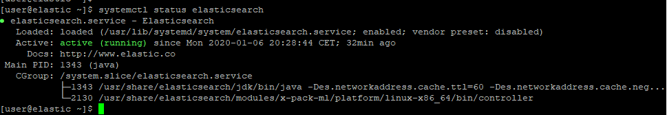
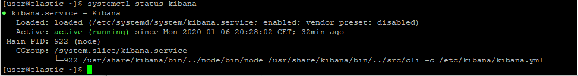
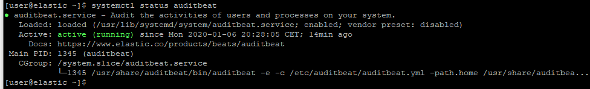

# 0 Lange nicht da - Alles Okay?
## 0.1 läuft unser "Stack" noch?
  *  systemctl status elasticsearch
  
  *  systemctl status kibana
  
  *  systemctl status auditbeat
  

*  netstat -tuan |grep -E "5601|9300|9200"

